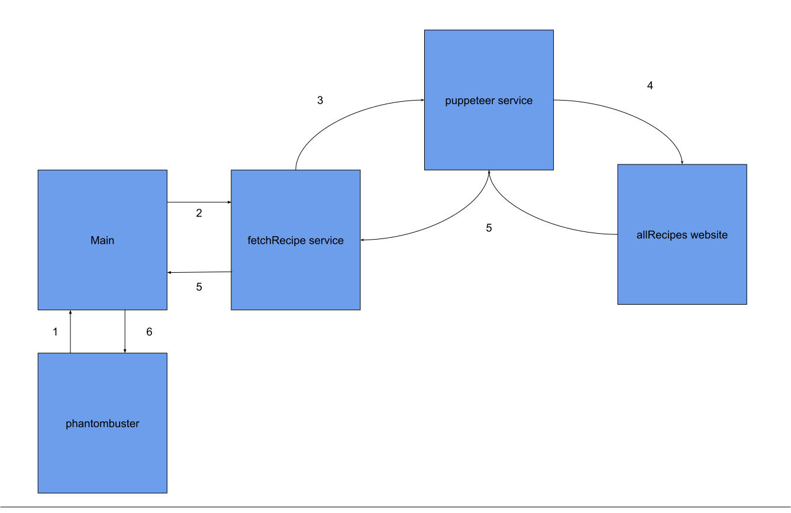
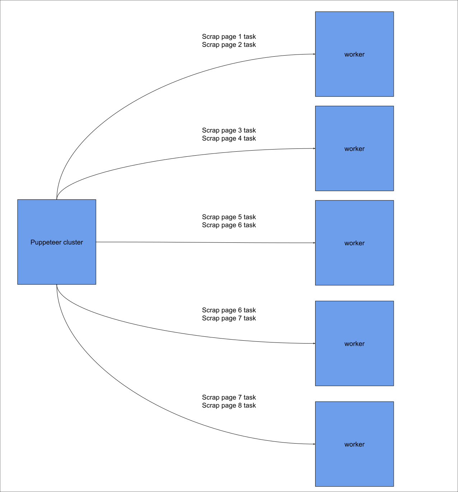

# Recipe scrapper

## Foreword
Since there are no phantombuster package available on npm the script will not work unless all calls made to phantombuster package are removed (and therefore the import)

## Intro
This project contains a script that allow scrapping recipes from a website called [allRecipes](https://allrecipes.com/) and then send them into phantombuster

## Setup

### Install dependencies
```bash
$ npm i
```

Then copy the file phantombuster.cson.example and rename it to phantombuster.cson and file in the necessary informations

You need to create an account on phantombuster and get an API key

See [quickstart tutorial to setup a phantombuster profile)](https://hub.phantombuster.com/docs/developer-quick-start)

```cson
[
    name: 'your-name'
    apiKey: 'your-api-key'
    scripts:
        'your-script-name': 'path-to-your-script'
]
```


### Compiling the script
```bash
$ npm run build
```


### Deploying the script on phantombuster
```bash
$ npm run deploy
```


### 

## Test

```bash
# unit tests
$ npm test
```

## Technical stacks

- typescript
- puppeter: A library that deliver an API to handle web scrapping
- puppeter-cluster: A wrapper on top of puppeter that allows running several pages scrapping in parallel
- phantombuster: a cloud function that allows running our script featuring data storage (useful for saving the recipes we have scrapped beforehand)
- webpack: A tool used to bundle our code
- class-validator: A decorator based library used to validate incoming objects
- pino: for logging purposes

## Architecture 

### Domain

There are 2 domain objects in the codebase

#### Recipe

A recipe is a set of instructions for preparing a dish, it contains:
- The name of the recipe
- A rating 
- A ratings count
- An url to the recipe

#### RecipeFilter

Upon searching for a recipe, a set of filters can be applied to narrow the results
This filters are:
- The name of the recipe/ingredient to look for
- The number of pages to scrap
- A minimum rating on the recipe (between 0 and 5)
- A maximum rating on the recipe (between 0 and 5)
- A  minimum number of ratings count 
- A maxmimum number of ratings count


### Workflow



The script accepts 5 filters in the argument provided through phantombuster which are in fact the properties expected in a RecipeFilter instance

There are 6 steps in the script

The entrypoint is located in main.ts, this is the script that is executed by phantombuster runner. The script will first instanciate the api with phantombuster (1).

After that a call is made to fetchRecipe service (2) to setup the filters received in arguments

If the arguments are valid a call to puppeteer is made (3) to scrap the requested data, the latter then scraps the data on allRecipes website (4)

Once the recipes have been scrapped (5) the recipes are formatted into domain object and forwarded to the entrypoint script (main)

Finally the recipes are uplodaded to phantombuster (6)


#### Handling multiples page scrapping



5 workers are allocated in case multiples pages are requested and the tasks are distributed and queued between each workers
